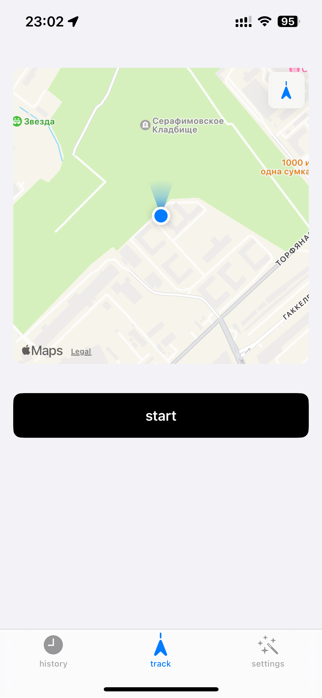
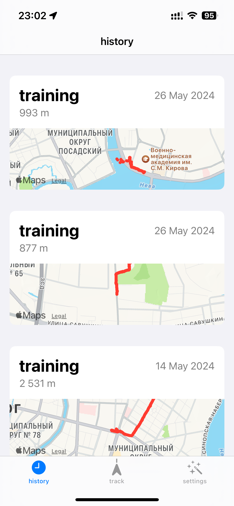
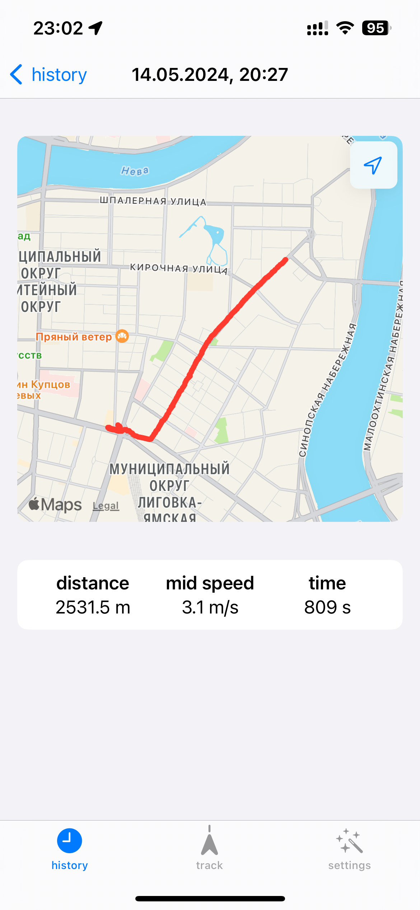

# itmo.running

iOS application to monitor and save your runnings

- Easily track your runnings
- Save your runnings and see the detailed path
- All your data is synced across all your devices

## Screenshots

  
  
  

## Build

1. Install latest `Xcode` from `App Store` or [Xcode releases](https://xcodereleases.com)
2. Open `ITMORunning.xcworkspace`
3. Enjoy the project
